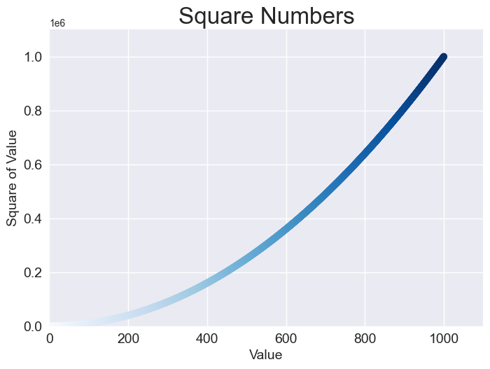
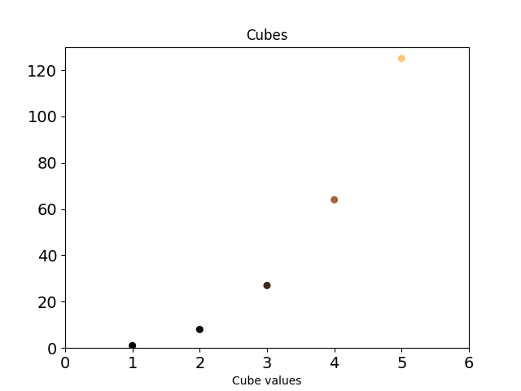

# data_visualization_project


Repo for following along with the Python Crash Course 2nd edition project 2 - Data Visualization

Tested only on Windows

Book - https://nostarch.com/python-crash-course-3rd-edition

# First time setup

### Create virtual environment

```python
py -3.11 -m venv venv
```

Activate environment

```python
venv/Scripts/activate
```

Upgrade pip

```python
py -m pip install --upgrade pip
```

Install requirements

```python
py -m pip install -r requirements.txt
```

## Chapter 15

scatter_squares.py
Blues colormap, setting style, fonts, axis names

scatter_cubes.py
Custom scatter plat

